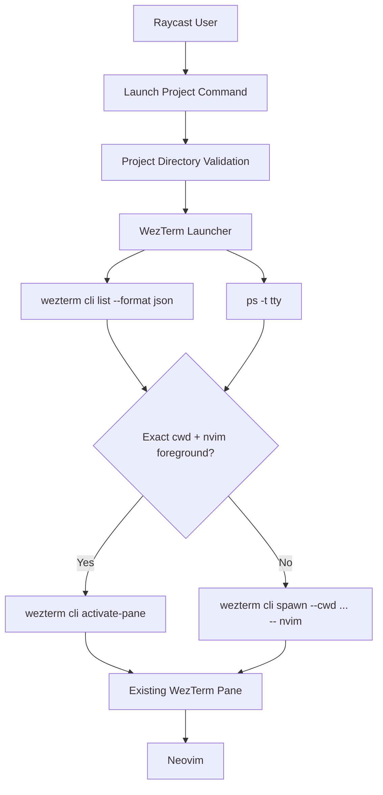

# System Design & Architecture

## Architecture Overview

**What is the high-level system structure?**

- The Raycast command continues delegating launch behavior to the terminal abstraction.
- The WezTerm launcher gains a resolution step that inspects existing panes before deciding whether to focus or spawn.
- WezTerm provides pane ids, cwd values, and tty names; `ps` provides the foreground command for each candidate tty.

## Data Models

**What data do we need to manage?**

- `LaunchProjectRequest`
  - `project: Project`
  - `editorCommand: string`
- `WezTermPaneRecord`
  - `pane_id: number`
  - `cwd?: string`
  - `tty_name?: string`
  - `is_active?: boolean`
  - `title?: string`
- `PaneForegroundProcess`
  - `ttyName: string`
  - `commandBasename?: string`
- `LaunchResolution`
  - `type: "focus-existing-pane" | "spawn-new-pane"`
  - `paneId?: number`

- Data flow:
- The launcher queries `wezterm cli list --format json` and parses the pane list.
- Candidate panes are filtered to those whose cwd normalizes to the selected project path.
- For each candidate, the launcher queries `ps -t <tty> -o ... command` and extracts the foreground command.
- The first exact match returned by `wezterm cli list` whose foreground command basename is `nvim` becomes a `focus-existing-pane` resolution.
- If no candidate passes both checks, the launcher falls back to `spawn-new-pane`.

## API Design

**How do components communicate?**

- External interface:
- `launchProject(request: LaunchProjectRequest): Promise<void>` remains the command-facing entry point.

- Internal interfaces:
- `buildWezTermListArgs(): string[]`
- `buildWezTermActivatePaneArgs(paneId: number): string[]`
- `buildWezTermSpawnArgs(request: LaunchProjectRequest): string[]`
- `resolveLaunchTarget(request: LaunchProjectRequest): Promise<LaunchResolution>`
- `parseWezTermPaneList(stdout: string): WezTermPaneRecord[]`
- `getForegroundProcessForTty(ttyName: string): Promise<PaneForegroundProcess | undefined>`

- Request/response shape:
- Resolution returns either a matched `paneId` to activate or a spawn decision.
- Command execution errors continue flowing through the existing `ProjectError` mapping so the Raycast UI behavior stays consistent.

- Authentication/authorization:
- None required. The enhancement uses only local WezTerm CLI and local process inspection on the same machine.

## Component Breakdown

**What are the major building blocks?**

- `src/terminals.ts`
  - Extend the WezTerm launcher to inspect panes, resolve launch targets, activate matched panes, or spawn new panes.
- `src/utils/process.ts`
  - Reuse the command runner for both WezTerm CLI calls and `ps` calls.
- `src/terminals.test.ts`
  - Add unit coverage for pane-list parsing, foreground-process matching, focus behavior, and spawn fallback.

## Design Decisions

**Why did we choose this approach?**

- `wezterm cli list --format json` already exposes the critical pane metadata needed to match on cwd and focus by pane id.
- `ps -t <tty>` is preferred over pane title heuristics because it checks the actual foreground process associated with the pane tty.
- Exact cwd matching avoids surprising jumps into unrelated nested folders or sibling repositories.
- The resolution logic stays inside the terminal integration so the Raycast command layer remains unchanged.

- Alternatives considered:
- Match on WezTerm pane title alone: rejected because titles are heuristic and can be changed independently of the running process.
- Match on cwd alone: rejected because a shell sitting in the project root should not suppress spawning a new `nvim` session.
- Use custom WezTerm Lua scripting to expose richer pane state: rejected for now because the existing CLI plus `ps` is sufficient and requires no user config changes.
- Detect Neovim inside `tmux`: rejected in v1 because the foreground tty process is `tmux`, which would require a different integration path.

## Non-Functional Requirements

**How should the system perform?**

- Performance:
- Pane resolution should add only a small local-process overhead before launch, limited to one WezTerm list call and `ps` calls for cwd-matching candidates.
- The launcher should stop scanning candidates as soon as it finds a deterministic exact match.

- Scalability:
- The matching logic should remain reliable for dozens of open panes in a single WezTerm workspace.
- The terminal abstraction should still allow other backends later, even though this enhancement is WezTerm-specific.

- Security:
- Continue using structured process arguments without shell interpolation.
- Normalize and compare filesystem paths before matching.

- Reliability/availability:
- If pane inspection fails, the launcher should prefer the existing spawn fallback rather than block opening the project entirely, unless the failure is a direct WezTerm invocation error that should still surface to the user.
- Matching should ignore panes missing cwd or tty metadata.
