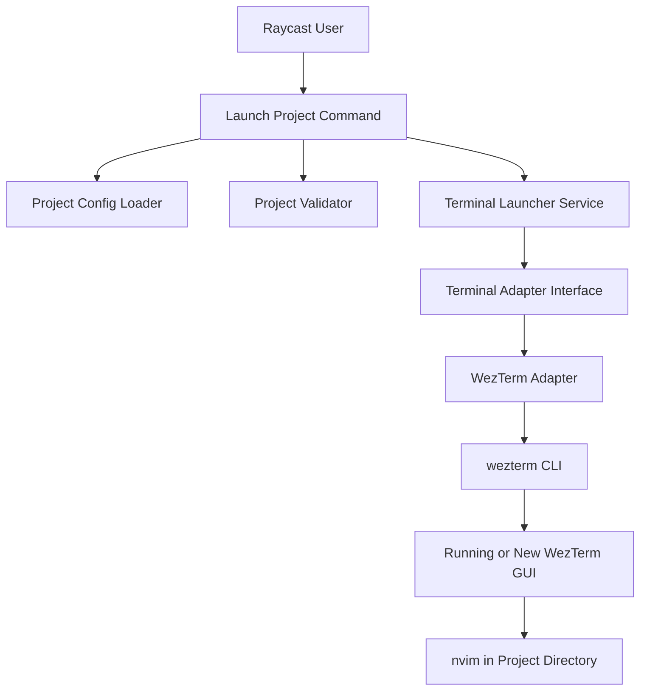

# System Design & Architecture

## Architecture Overview
**What is the high-level system structure?**

- The extension is a single Raycast `view` command that renders configured projects and launches the selected one.
- Project definitions are loaded from local configuration rather than discovered dynamically.
- Launch behavior is delegated to a terminal adapter interface so the command layer remains terminal-agnostic.
- The initial adapter targets WezTerm via its CLI because that is the most direct documented way to spawn a new tab with a working directory and command.

## Data Models
**What data do we need to manage?**

- `ProjectConfig`
  - `id: string`
  - `name: string`
  - `path: string`
  - `description?: string`
- `LaunchProjectRequest`
  - `project: ProjectConfig`
  - `editorCommand: string[]`
- `TerminalLauncher`
  - `launchProject(request: LaunchProjectRequest): Promise<void>`

- Data flow:
- Command loads raw config text from preferences-backed file path.
- Config loader parses and validates JSON into `ProjectConfig[]`.
- User selection creates a `LaunchProjectRequest`.
- The selected terminal adapter translates the request into CLI arguments.

## API Design
**How do components communicate?**

- External interface:
- Raycast command entry point renders the list UI and calls a launch action when the user confirms a project.

- Internal interfaces:
- `loadProjects(preferences): Promise<ProjectConfig[]>`
- `validateProject(project): Promise<void>`
- `createTerminalLauncher(kind): TerminalLauncher`
- `launchProject(request): Promise<void>`

- Request/response shape:
- Config loader returns validated project objects or throws typed errors for malformed input.
- Terminal launcher resolves on success and throws rich errors on command lookup, process failure, or invalid path conditions.

- Authentication/authorization:
- None required. The extension only uses local filesystem access and local process execution.

## Component Breakdown
**What are the major building blocks?**

- `src/launch-project.tsx`
  - Raycast UI for listing, filtering, and selecting projects.
- `src/preferences.ts` or equivalent
  - Typed access to Raycast preferences and config file path.
- `src/projects/*`
  - Config parsing, normalization, and validation.
- `src/terminals/types.ts`
  - Shared launcher interface and request types.
- `src/terminals/wezterm.ts`
  - WezTerm-specific process argument builder and invocation.
- `src/utils/process.ts`
  - Small process runner wrapper for child-process execution and error mapping.

## Design Decisions
**Why did we choose this approach?**

- A single command with a list is simpler than generating one command per project and aligns with the user's preferred workflow.
- A config-file-based project source scales better than one preference per project and avoids frequent manifest edits when the project list changes.
- WezTerm CLI is preferred over GUI scripting because the CLI documents `--cwd` and `start --new-tab`, which maps directly to the required behavior from Raycast.
- The launcher should prefer WezTerm's documented "new tab in an existing GUI instance" flow rather than probing clients and forcing window creation.
- A terminal adapter boundary is used now, even with one backend, because terminal-launch semantics are the main axis of likely future growth.

- Alternatives considered:
- Multiple Raycast commands, one per project: rejected for higher maintenance and poorer scalability.
- AppleScript/UI automation against WezTerm: rejected in favor of documented CLI integration.
- Opening a new pane in an existing window: rejected because the requirement explicitly calls for a new tab, not a pane split.

## Non-Functional Requirements
**How should the system perform?**

- Performance:
- Project list should load quickly from a local config file and feel immediate in Raycast.
- Launch latency should be dominated by WezTerm and Neovim startup, with minimal extension overhead.

- Scalability:
- Project list size is expected to stay modest, but list filtering should handle dozens to low hundreds of projects.
- Adding a second terminal backend should be an additive change.

- Security:
- Validate filesystem paths before launch.
- Avoid shell interpolation when executing local processes.

- Reliability/availability:
- Show clear empty/error states for missing config, invalid JSON, missing paths, and unavailable `wezterm` executables.
- Fall back to starting WezTerm normally if no GUI instance is running, because no existing window is available to host a new tab.
