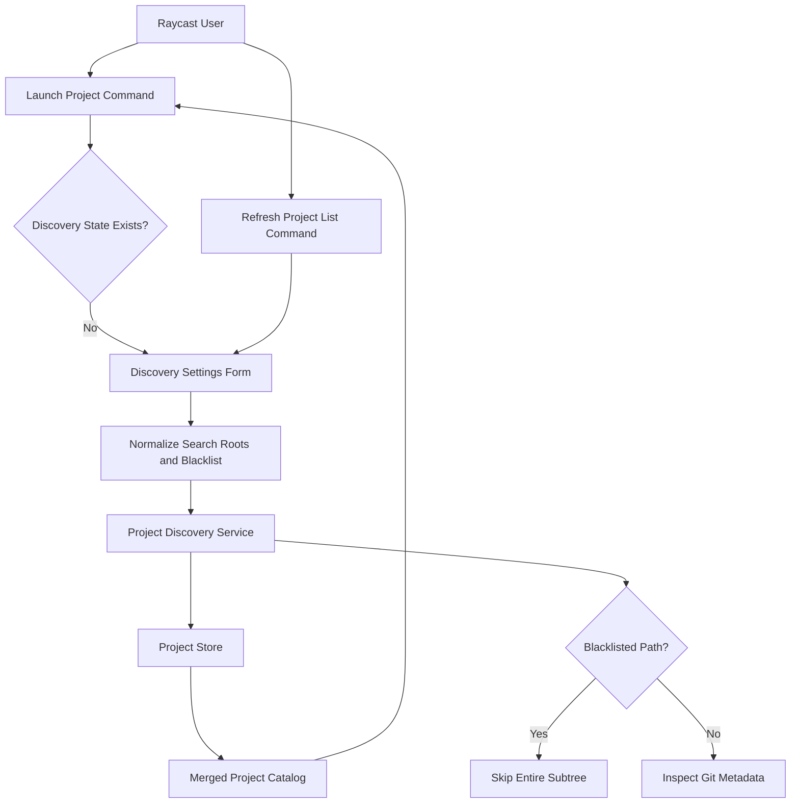

# System Design & Architecture

## Architecture Overview

**What is the high-level system structure?**

- Search roots and blacklist folders live in the same persisted discovery state so first launch and refresh share one source of truth.
- The shared form accepts and displays both lists, then submits them to the discovery service.
- Discovery checks blacklist membership before probing Git metadata or descending into child directories, which avoids unnecessary work in excluded trees.

## Data Models

**What data do we need to manage?**

- `ProjectDiscoveryResult`
  - `searchRoots: string[]`
  - `blacklistRoots: string[]`
  - `projects: Project[]`
- `StoredDiscoveryState`
  - `searchRoots: string[]`
  - `blacklistRoots: string[]`
  - `detectedProjects: Project[]`
  - `hasCompletedInitialDiscovery: boolean`
  - `lastRefreshedAt?: string`
- Derived runtime state
  - `ProjectCatalogState.searchRoots`
  - `ProjectCatalogState.blacklistRoots`
  - `ViewState.blacklistRoots`

- Data flow:
- The form parses both text areas into string arrays.
- Discovery normalizes and validates roots, then builds a compact set of blacklisted directories.
- Recursive traversal checks `isBlacklistedPath(directoryPath)` before reading child entries.
- The store persists both lists alongside detected projects so the UI can hydrate later sessions.

## API Design

**How do components communicate?**

- External interface:
- `launch-project` shows the discovery settings form when initial discovery has not completed.
- `refresh-project-list` loads the saved discovery settings into the same form for editing.

- Internal interfaces:
- `discoverProjects({ searchRoots, blacklistRoots }): Promise<ProjectDiscoveryResult>`
- `saveDiscoveryResult(result): Promise<void>`
- `getProjectCatalogState(): Promise<ProjectCatalogState>`
- `SearchRootsForm` becomes a shared discovery-settings form component that accepts initial search roots and blacklist folders.

- Authentication/authorization:
- None. Everything remains local to Raycast and the filesystem.

## Component Breakdown

**What are the major building blocks?**

- `src/search-roots-form.tsx`
  - Expanded to edit both search roots and blacklist folders.
  - Syncs internal textarea state when async-loaded initial values change.
- `src/project-discovery.ts`
  - Accepts blacklist inputs, validates them, and skips matching subtrees early in traversal.
- `src/project-store.ts`
  - Persists and reads blacklist folders in discovery state.
- `src/launch-project.tsx`
  - Passes initial blacklist values into the shared form during bootstrap.
- `src/refresh-project-list.tsx`
  - Loads saved blacklist values and passes them into the shared form.

## Design Decisions

**Why did we choose this approach?**

- Keeping blacklist folders inside discovery state avoids splitting closely related configuration across multiple storage keys or preferences.
- Path-based subtree exclusion is simpler and less error-prone than introducing glob matching for a small extension.
- Syncing form state from async props addresses the current refresh-form regression without adding unnecessary state management layers.

- Alternatives considered:
- Store blacklist folders in extension preferences: rejected because discovery settings already belong to the same editable workflow as search roots.
- Filter projects only after discovery finishes: rejected because it still wastes time traversing directories that should be skipped entirely.
- Use Raycast `storeValue` on form fields: rejected because the extension already has authoritative persisted discovery state and needs predictable merging with refresh results.

## Non-Functional Requirements

**How should the system perform?**

- Performance:
- Blacklisted directories must be skipped before recursion so refreshes get faster on large ignored trees.
- Normal launcher reads should remain storage-only and should not trigger a scan.

- Scalability:
- The blacklist implementation should handle multiple roots and nested exclusions deterministically.

- Reliability/availability:
- Invalid blacklist paths should produce actionable errors instead of being silently ignored.
- Previously saved search roots and blacklist folders must survive Raycast restarts.

- Security:
- All submitted paths must continue to be normalized and validated before saving or scanning.
