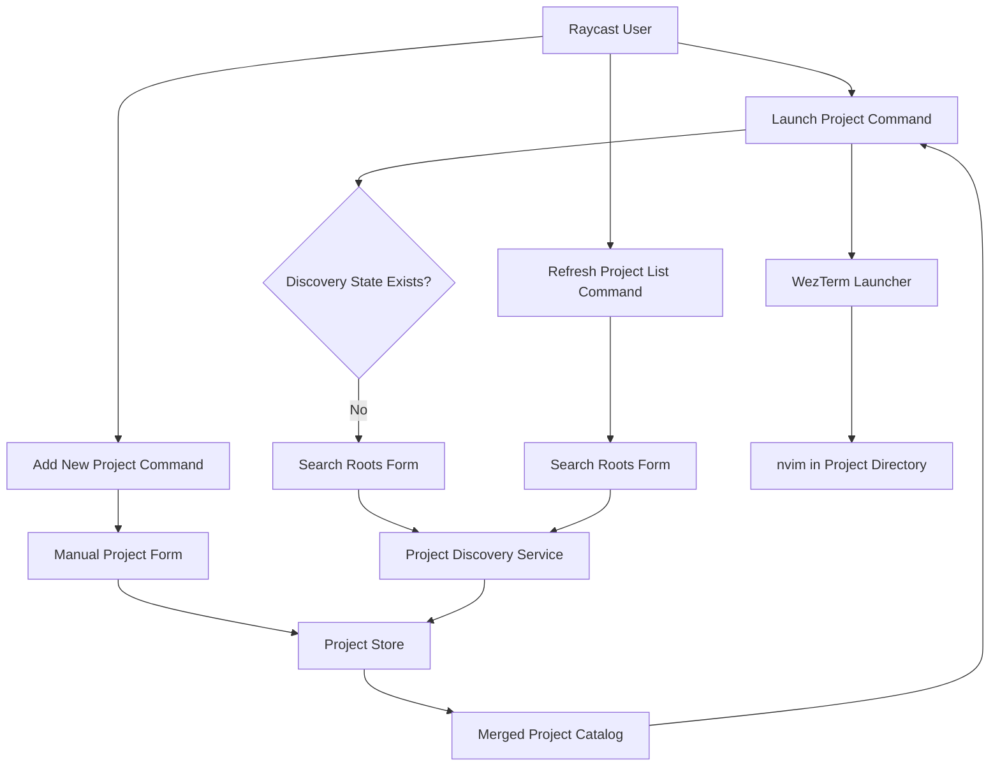

# System Design & Architecture

## Architecture Overview

**What is the high-level system structure?**

- Raycast commands remain the UI entry points, but project data moves from an external JSON file to internal persisted storage.
- The main command owns the first-launch bootstrap experience when discovery has never been run.
- A discovery service scans user-provided roots for Git repositories, filters out linked Git worktree checkouts using Git metadata, and writes only eligible projects to storage.
- A store layer persists search roots, detected projects, manual projects, and discovery status, then exposes a merged catalog for the launcher.

## Data Models

**What data do we need to manage?**

- `StoredProject`
  - `id: string`
  - `name: string`
  - `path: string`
  - `description?: string`
  - `source: "detected" | "manual"`
- `ProjectDiscoveryState`
  - `searchRoots: string[]`
  - `detectedProjects: StoredProject[]`
  - `hasCompletedInitialDiscovery: boolean`
  - `lastRefreshedAt?: string`
- `DiscoveryCandidateAssessment`
  - `path: string`
  - `hasGitEntry: boolean`
  - `isWorktreeCheckout: boolean`
  - `shouldInclude: boolean`
- `ManualProjectInput`
  - `name: string`
  - `path: string`
  - `description?: string`

- Data flow:
- Search roots are submitted from a Raycast form and normalized before scanning.
- Discovery first identifies directories with a `.git` entry, then inspects Git metadata to exclude linked worktree checkouts before creating detected projects.
- The store merges manual and detected projects by normalized path, with manual entries winning metadata conflicts.
- The launcher reads the merged catalog and reuses the existing WezTerm launch request shape.

## API Design

**How do components communicate?**

- External interface:
- `launch-project` renders either the first-launch setup form or the project list.
- `refresh-project-list` renders a form for editing scan roots and triggers discovery.
- `add-new-project` renders a form for adding one manual project.

- Internal interfaces:
- `discoverProjects(searchRoots): Promise<Project[]>`
- `assessDiscoveryCandidate(path): Promise<{ hasGitEntry: boolean; isWorktreeCheckout: boolean }>`
- `getProjectCatalog(): Promise<Project[]>`
- `saveDiscoveryResult({ searchRoots, detectedProjects }): Promise<void>`
- `saveManualProject(input): Promise<Project[]>`
- `getDiscoveryState(): Promise<ProjectDiscoveryState | undefined>`

- Authentication/authorization:
- None required. The extension uses local filesystem access and Raycast local storage only.

## Component Breakdown

**What are the major building blocks?**

- `src/launch-project.tsx`
  - Main launcher and first-launch bootstrap UI.
- `src/refresh-project-list.tsx`
  - Search-root form and manual refresh flow.
- `src/add-new-project.tsx`
  - Manual project creation form.
- `src/project-discovery.ts`
  - Recursive filesystem scan for Git projects plus Git-metadata checks that exclude linked worktree checkouts.
- `src/project-store.ts`
  - Raycast local storage read/write helpers and catalog merge logic.
- `src/projects.ts`
  - Shared path normalization, project validation, and duplicate handling utilities.

## Design Decisions

**Why did we choose this approach?**

- Raycast local storage is the simplest persistence layer for extension-owned data and avoids making users manage a file themselves.
- A first-launch form fits the requirement to ask users for search roots without overloading extension preferences.
- Manual projects are stored separately from detected projects so refreshes can rebuild the detected set without deleting user-authored entries.
- Discovery is explicit and command-driven after bootstrap, which keeps normal launcher latency low and avoids unexpected filesystem scans.
- Worktree exclusion is based on Git metadata instead of directory naming conventions so linked worktrees are skipped correctly even when they live outside a `.worktrees` path.

- Alternatives considered:
- Keep the JSON file and generate it automatically: rejected because it still exposes file management to the user.
- Store search roots in extension preferences: rejected in favor of an in-command form that can be reused by first launch and refresh.
- Rescan on every launcher open: rejected because the requirement explicitly limits automatic detection to first launch only.
- Exclude worktrees by path convention alone: rejected because linked worktrees can live in arbitrary locations and would create false negatives and false positives.

## Non-Functional Requirements

**How should the system perform?**

- Performance:
- The launcher should read persisted data without performing a filesystem scan after initial setup.
- Discovery should skip descending into `.git` directories and tolerate large directory trees without crashing.

- Scalability:
- The catalog should handle dozens to low hundreds of projects.
- Merge logic must remain deterministic when users combine detected and manual projects.

- Security:
- Normalize and validate all submitted paths before saving or launching.
- Use Node filesystem APIs directly rather than shelling out to `find`.

- Reliability/availability:
- Invalid roots or project paths should be reported with actionable Raycast errors.
- Linked Git worktree checkouts should be excluded deterministically based on Git metadata rather than local folder naming conventions.
- A discovery run that finds zero projects should still persist completion state so first-launch bootstrap does not repeat forever.
